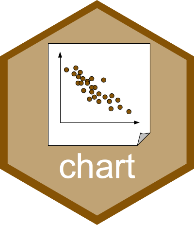
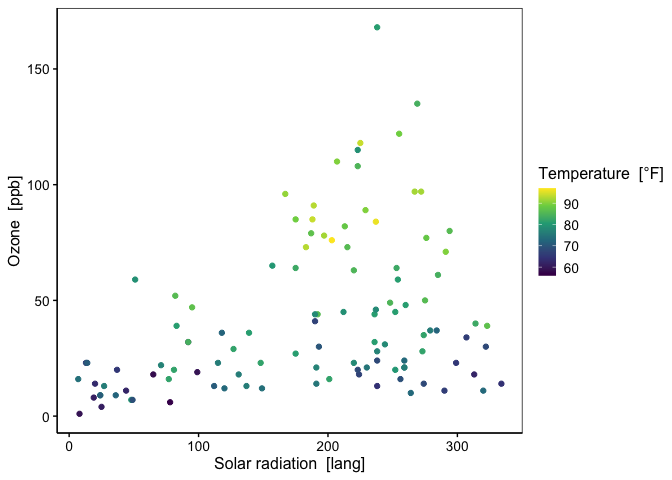

Unified Interface (with Formula) for R Plots
<a href='https://www.sciviews.org/chart'></a>
================

<!-- Do not edit the README.md file directly. It is generated from README.Rmd. -->
<!-- badges: start -->

[](https://github.com/SciViews/chart/actions/workflows/R-CMD-check.yaml)
[](https://app.codecov.io/gh/SciViews/chart?branch=main)
[](https://cran.r-project.org/package=chart)
[](https://sciviews.r-universe.dev/chart)
[](https://opensource.org/licenses/MIT)
[](https://lifecycle.r-lib.org/articles/stages.html#stable)

<!-- badges: end -->

The {chart} package provides an alternate formula interface to
{ggplot2}, and it also homogenize plot outputs from base R plots,
{lattice} and {ggplot}. If labels and/or units attributes are defined
for variables in the data, they are used automatically to construct the
label (with units) of the axes. See <https://www.sciviews.org/chart/>
for more details.

## Installation

{chart} is not available from CRAN yet. You should install it from the
[SciViews R-Universe](https://sciviews.r-universe.dev). The {data.io}
package is useful too because it manages labels and units that {chart}
uses. To install those two packages and their dependencies, run the
following command in R:

``` r
install.packages(c('chart', 'data.io'),
  repos = c('https://sciviews.r-universe.dev', 'https://cloud.r-project.org'))
```

You can also install the latest development version of {chart}. Make
sure you have the {remotes} R package installed:

``` r
install.packages("remotes")
```

Use `install_github()` to install the {chart} package from GitHub
(source from **main** branch will be recompiled on your machine):

``` r
remotes::install_github("SciViews/chart")
```

R should install all required dependencies automatically, and then it
should compile and install {chart}.

## Further explore {chart}

Starting from the `airquality` from {datasets}, we can annotate our
dataset with labels and units for its variable like this:

``` r
data(airquality, package = "datasets")
airquality <- data.io::labelise(airquality, label = list(
  Ozone = "Ozone", Temp = "Temperature", Solar.R = "Solar radiation",
  Wind = "Wind speed"
), units = list(
  Ozone = "ppb", Temp = "°F", Solar.R = "lang", Wind = "mph"
))
```

here is a first {chart}:

``` r
library(chart)
chart(airquality, Ozone ~ Solar.R %col=% Temp) +
  geom_point(na.rm = TRUE)
```



You will notice that the syntax is relatively close to {ggplot2}, except
that `ggplot()` is here replaced by `chart()` and
`aes(x = Solar.R, y = Ozone, col = Temp)` is replaced by a formula using
`y ~ x` plus an optional series of `%<arg>%` terms where `<arg>` is the
argument you would use in {ggplot2}’s `aes()` instruction (the `aes()`
form is also accepted in `chart()`). The default style is also different
and closer to a “publication-ready” version of the plot. Finally, labels
and units we defined above in the `airquality` dataset are automatically
used. Of course, you can override these labels with `labs()` if you
want.

`chart()` is compatible with all {ggplot2} and ggplot2 extensions. It
can also be used to create {lattice} or base R plots. Several
specialized plots are available through `chart()` methods and types in
separate packages, such as
[{modelit}](https://www.sciviews.org/modelit/) and
[{exploreit}](https://www.sciviews.org/exploreit/).

For further details, see <https://www.sciviews.org/chart/>. You can get
further help about this package this way:

``` r
library(help = "chart")
help("chart-package")
vignette("chart") # Not installed with install_github()
```

## Code of Conduct

Please note that the {chart} package is released with a [Contributor
Code of
Conduct](https://contributor-covenant.org/version/2/1/CODE_OF_CONDUCT.html).
By contributing to this project, you agree to abide by its terms.
